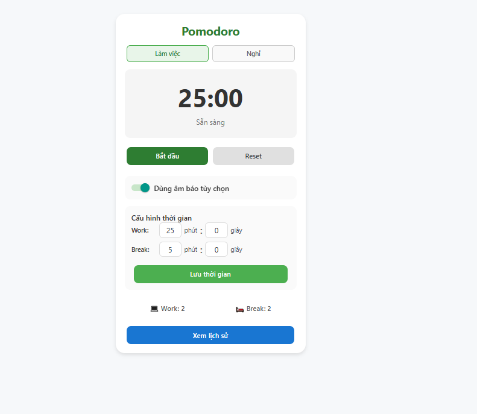
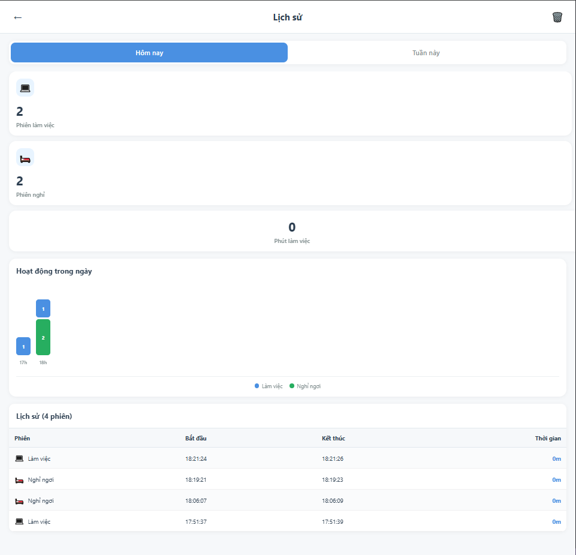
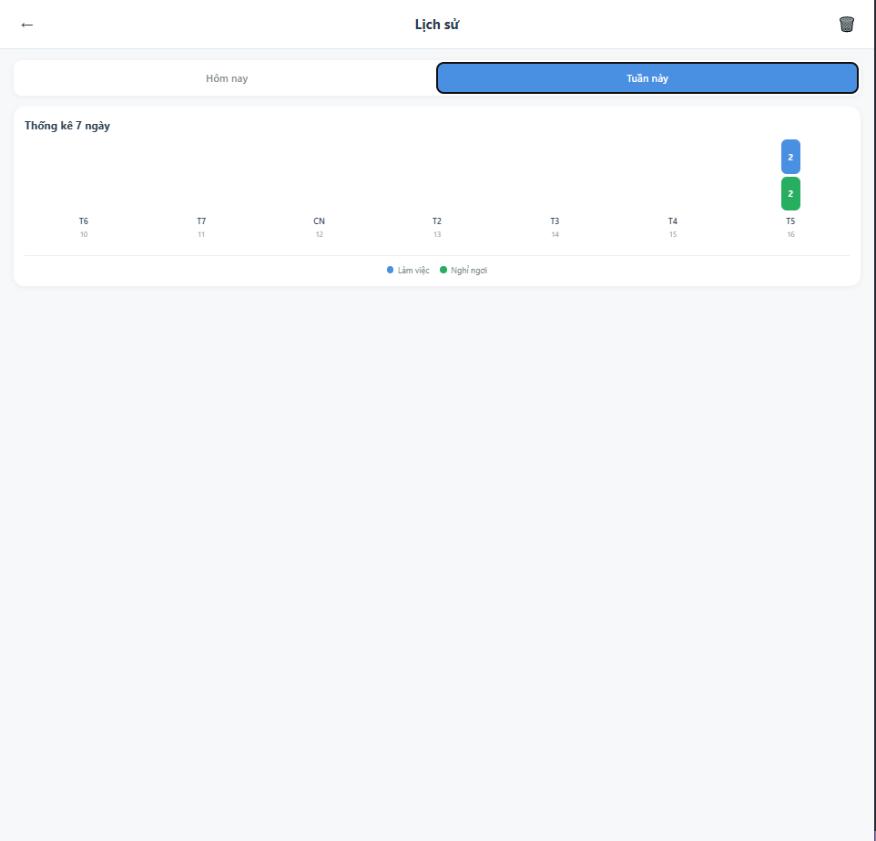

# 🍅 Pomodoro Timer App
Pomodoro Timer là ứng dụng được phát triển bằng React Native Expo, giúp bạn quản lý thời gian làm việc và nghỉ ngơi một cách khoa học và hiệu quả.

## ✨ Tính năng
### Yêu cầu tối thiểu 
- **🕒Chế độ Pomodoro: Làm việc (25 phút) và Nghỉ ngơi (5 phút)**
- **Chỉnh được giờ làm việc và nghỉ ngơi**
- **Hẹn giờ chạy nền và gửi thông báo khi hoàn thành phiên bằng (expo-notifications)**
- **Tự động lưu lịch sử phiên vào AsyncStorage**
- **Rung cảnh báo nhẹ khi kết thúc mỗi phiên (expo-haptics)**
- **Giữ màn hình luôn bật trong suốt quá trình đếm giờ (expo-keep-awake)**

### Tính năng mở rộng
-  **Đếm số phiên làm việc và phiên nghỉ hôm nay**
-  **Biểu đồ thống kê theo ngày và theo 7 ngày gần nhất**
-  **Tự động chuyển đổi giữa Work và Break**
-  **Màn hình lịch sử phiên hôm nay**
-  **Reponsive UI/UX**

## 🚀 Cài đặt và Chạy

### 1. Cài đặt dependencies
```bash
cd pomodoro-timer
npm install
npx expo install expo-notifications expo-av
npx expo install react-dom react-native-web
npm install react-native-chart-kit react-native-svg
```

### 2. Chạy ứng dụng

**Trên Android:**
```bash
npm run android

**Trên iOS (cần macOS):**
```bash
npm run ios

**Trên Web:**
```bash
npm run web
chạy ở link http://localhost:8081/
```

**Sử dụng Expo Go :**
```bash
npx expo start
```
Sau đó quét QR code bằng app Expo Go trên điện thoại.

## 📱 Hướng dẫn sử dụng

1) Chọn chế độ 👨‍💻/☕️: Nhấn "Làm việc" để bắt đầu một phiên tập trung (mặc định 25 phút), hoặc chọn "Nghỉ" để bắt đầu một phiên thư giãn (mặc định 5 phút).

2) Điều khiển thời gian : Nhấn "Bắt đầu" để khởi động bộ đếm. Trong khi đồng hồ đang chạy, bạn có thể "Tạm dừng" và "Tiếp tục" bất cứ lúc nào.

3) Đặt lại : Nhấn "Reset" để đưa bộ đếm thời gian trở về trạng thái ban đầu của chế độ hiện tại (ví dụ: 25:00 hoặc 05:00).

4) Tùy chỉnh thời gian ⚙️: Nhập số phút và giây mong muốn cho từng chế độ Làm việc và Nghỉ. Sau đó nhấn "Lưu thời gian" để áp dụng thiết lập mới của bạn.

5) Theo dõi thống kê 📊: Ứng dụng tự động đếm tổng số phiên Làm việc 🖥️ và Nghỉ ☕ đã hoàn thành. Nhấn "Xem lịch sử" để xem chi tiết và biểu đồ trực quan về tiến độ của bạn.
## Công cụ sử dụng

- **React Native** với **Expo SDK **
- **@react-navigation/native** - Điều hướng giữa các màn hình
- **@react-native-async-storage/async-storage** - Lưu trữ dữ liệu local
- **expo-notifications** - Thông báo khi hết giờ
- **expo-keep-awake** - Giữ màn hình sáng
- **expo-haptics** - Phản hồi rung
- **expo-device** - Kiểm tra thiết bị

## 📁 Cấu trúc dự án

```
📦 pomodoro-timer/
├── src/
│   ├── assets/                     # Tài nguyên (ảnh, âm thanh, icon, ...)
│   ├── config/                     # Cấu hình chung
│   ├── screens/                    # Các màn hình chính của ứng dụng
│   │   ├── HistoryScreen/          # Màn hình lịch sử
│   │   │   ├── HistoryLogic.js     # Xử lý logic màn hình lịch sử
│   │   │   ├── HistoryScreen.js    # Thành phần chính hiển thị lịch sử
│   │   │   ├── HistoryUI.js        # Giao diện người dùng
│   │   │   └── index.js            # File xuất tổng hợp
│   │   ├── TimerScreen/            # Màn hình hẹn giờ Pomodoro
│   │   │   ├── TimerLogic.js       # Xử lý logic hẹn giờ
│   │   │   ├── TimerScreen.js      # Thành phần chính hiển thị hẹn giờ
│   │   │   ├── TimerStyles.js      # Định dạng style
│   │   │   ├── TimerUI.js          # Giao diện người dùng
│   │   │   └── index.js            # File xuất tổng hợp
│   ├── utils/                      # Tiện ích chung
│   │   ├── storage.js              # Quản lý AsyncStorage (lưu dữ liệu cục bộ)
│   │   └── notifications.js        # Quản lý thông báo cục bộ
│   ├── App.js                      # Điểm khởi đầu ứng dụng
│   ├── app.json                    # Cấu hình Expo
│   └── index.js                    # Điểm vào chính (entry point)
├── package.json                    # Thông tin dependencies
└── .gitignore                      # Bỏ qua các file không cần commit

```

## 🔧 Lưu ý

- **Notification** chỉ hoạt động trên thiết bị thật, không hoạt động trên simulator/emulator
- **Haptic feedback** cũng cần thiết bị thật
- Trên iOS, cần cấp quyền notification lần đầu sử dụng
- Trên Android, app tự động xin quyền

# Demo App

## Giao diện app:


## Thống kê theo ngày:


## Thống kê theo tuần:

